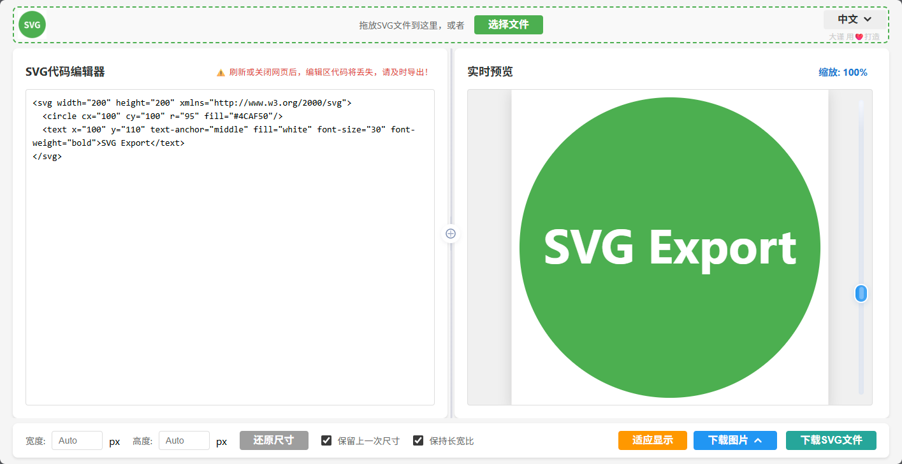
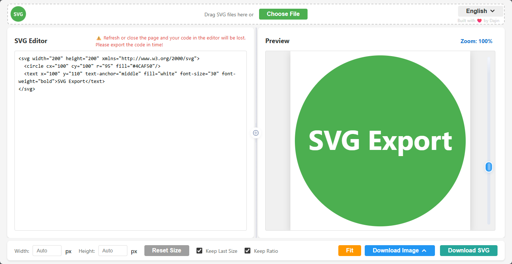

# SVG Editor & Image Exporter

   
  <b>智能在线 SVG 编辑器 / 实时预览 / 多格式图片导出工具</b> 
  <b>Intelligent Online SVG Editor / Real-Time Preview / Multi-Format Exporter</b>

---

## 🚀 功能亮点 Highlights

### 中文简介

- **SVG 代码编辑**：直接编辑、粘贴 SVG XML，实时反馈。
- **实时预览**：右侧预览 SVG，支持缩放/拖拽，多终端支持。
- **多格式导出**：一键导出 PNG、JPEG、WebP，也能导出原 SVG 文件。
- **分栏宽度拖拽+一键均分**：编辑和预览区宽度自定义调整，中央小按钮一键复位。
- **分辨率自定义、图片和语言菜单弱高亮、键盘导航友好**
- **支持文件拖拽/选择导入 SVG、中英文界面切换**
- **风险提示：刷新或关闭网页将丢失内容，导出前请务必保存！**
  > ⚠️ 编辑区代码未自动保存，刷新或关闭网页后将丢失，请及时导出！

### English Introduction

- **SVG code editing**: Directly edit and paste SVG XML, see immediate result.
- **Live Preview**: See your SVG instantly; support for interactive zoom and pan, mobile-friendly.
- **Multi-format Export**: Export to PNG, JPEG, WebP, and also download original SVG.
- **Resizable Panels & Central Reset**: Drag to adjust editor/preview width; one-click center split with a button.
- **Custom resolution, soft-highlighted menus, keyboard accessible**
- **File drag/drop/import, switchable English/Chinese UI**
- **Risk Tip: All code will be lost if you refresh or close the page. Please export first!**
  > ⚠️ Refresh or close the page and your code in the editor will be lost.  
  > Please export the code in time!

---

## 🌏 在线访问 / Live Demo

- [页面在线体验 Demo](https://mccoach.github.io/svg-to-png/)  
- 源码仓库：[https://github.com/mccoach/svg-to-png](https://github.com/mccoach/svg-to-png)

---

## ✨ 截图 Screenshot

| 中文版本                  |
|:-------------------------:|
|   |

| English Version           |
|:-------------------------:|
|   |

---

## 📝 使用方法 Usage

### 在线体验 Demo  

🔗 [Try Online / 立即使用](https://mccoach.github.io/svg-to-png/)

### 本地部署 / Run Locally

    git clone https://github.com/mccoach/svg-to-png.git
    cd svg-to-png
#### 推荐用VSCode Live Server，或：
    python -m http.server 8000
#### 浏览器访问 http://localhost:8000

---

## 🏗️ 文件结构 / File Structure

    /
    ├── index.html
    ├── css/
    │   └── style.css
    ├── js/
    │   ├── main.js
    │   ├── render.js
    │   ├── svgpng.js
    │   ├── lang-en.js
    │   └── lang-zh.js
    ├── assets/
    │   └── favicon.ico
    ├── screenshot-en.png
    ├── screenshot-zh.png
    └── README.md

---

## 🌐 多语言 / Language

- 右上角下拉按钮可一键切换 “English / 中文”
- 所有菜单、控件、风险提示会自动切换中/英文
- **GitHub 的 README.md 只能双语并排，不支持点击切换语言**

---

## 📦 主要特性 Features

- 拖拽/选择 SVG 文件导入，编辑区自动填充
- 实时渲染和缩放（滚轮/拖动/移动端手势皆可用）
- 菜单弱高亮，键盘/鼠标/无障碍兼容，移动端友好
- 一键导出 PNG/JPEG/WebP，并导出 SVG
- 分栏宽度和预览缩放条可随意调整
- 编辑器标题处常驻风险提示，中英文同步切换

---

## 🙋 FAQ

**Q: 为什么刷新后内容丢失？**  
A: 纯前端编辑器，不自动存储。请在刷新或关闭页面前及时“导出图片”或“下载SVG源代码”。

**Q: 菜单三角形/指示图标不显示怎么办？**  
A: 检查 HTML 结构中 download-caret 相关 SVG 和 CSS 是否存在，并未被 display:none 或 overflow:hidden 某些父元素遮挡。

**Q: 怎么用手机/平板？**  
A: 支持。缩放条也能触控，菜单可手指点击。

---

## 🏷️ License

MIT

---

欢迎 Star / Fork ，热烈欢迎提出意见反馈或 PR！ 
Welcome to Star, Fork and send PRs or issues!

